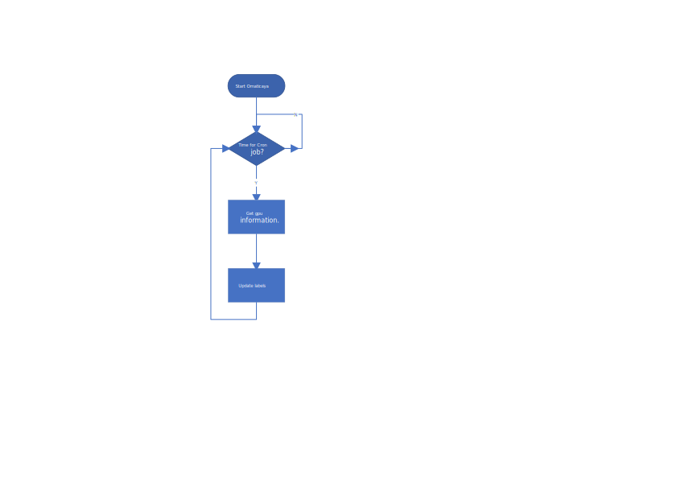

[简体中文](../README.md)

Omaticaya is planned to be a cluster-wide gpu infomation monitoring tool for kubernetes.

In order to compensate for kube-scheduler's lack of flexibility, a sheduling framework plugin is needed, to perform finer-grained Filtering as well as Scoring, or customized scheduling in special cases.

The Omaticaya project is thus initiated, to provide real-time comprehensive information about gpu within the cluster.

